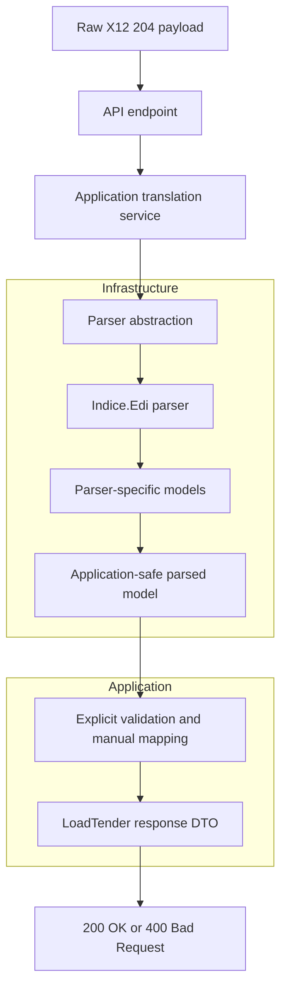

<div align="center">

<h1>EDI 204 Load Tender Integration Engine</h1>

<p><strong>A focused .NET 8 showcase for translating ASC X12 204 load tenders into clean JSON with explicit mapping and pragmatic Clean Architecture.</strong></p>

<p align="center">
  
  
  
  
</p>

</div>

## Executive Summary

This project is a portfolio-grade demo of a problem many logistics platforms still face every day: converting legacy EDI into a contract modern systems can actually consume.

The scope is intentionally narrow. It demonstrates one strong synchronous flow for **ASC X12 204 (Motor Carrier Load Tender)** translation, with explicit mapping, predictable validation, and a repo structure that shows architectural discipline without burying the demo under unnecessary infrastructure.

## What This Demo Covers

- Raw `text/plain` X12 204 ingestion
- Translation into a clean JSON contract
- Required segment validation for a believable demo path
- Basic business context such as set purpose and pickup/delivery stops
- Manual mapping that is easy to debug and explain
- Parser isolation inside the Infrastructure layer

## What It Intentionally Does Not Cover

- Full 204 implementation-guide coverage
- Trading-partner-specific customizations
- EDI 990 / 214 follow-up transactions
- Queues, brokers, worker services, or async ingestion pipelines
- Production-hardening concerns such as HA, observability, and throughput tuning

## Quickstart

```bash
git clone https://github.com/YourUsername/EDI-to-REST-Logistics-Gateway.git
cd EDI-to-REST-Logistics-Gateway
dotnet run --project src/Logistics.EDI.API
```

The API will listen locally on the configured ASP.NET Core URL.

## Repository Structure

```text
src/
  Logistics.EDI.Domain/
  Logistics.EDI.Application/
  Logistics.EDI.Infrastructure/
  Logistics.EDI.API/
tests/
  Logistics.EDI.Application.Tests/
  Logistics.EDI.API.IntegrationTests/
```

## Interactive Demo Scenarios

### Scenario 1: Valid Load Tender

Post a valid X12 204 payload as raw text. Infrastructure parses the EDI document, Application applies explicit mapping and validation, and the API returns a readable JSON contract.

```bash
curl -X POST http://localhost:5000/api/v1/edi/translate-204 \
-H "Content-Type: text/plain" \
-d "ISA*00* *00* *ZZ*SENDERID       *ZZ*RECEIVERID     *250116*1230*U*00401*000000001*0*P*>~
GS*SM*SENDERID*RECEIVERID*20250116*1230*1*X*004010~
ST*204*0001~
B2**XXXX*9999999**PO~
B2A*00~
G62*37*20250116~
N1*SH*DIGIS LOGISTICS~
S5*1*CL~
N1*SF*DIGIS LOGISTICS~
S5*2*CU~
N1*ST*DESTINATION DC~
SE*10*0001~
GE*1*1~
IEA*1*000000001~"
```

Expected result:

```json
{
  "transactionId": "0001",
  "loadNumber": "9999999",
  "carrierAlphaCode": "XXXX",
  "setPurpose": "Original",
  "estimatedDeliveryDate": "2025-01-16T00:00:00Z",
  "shipperName": "DIGIS LOGISTICS",
  "stops": [
    {
      "sequence": 1,
      "type": "Pickup",
      "name": "DIGIS LOGISTICS"
    },
    {
      "sequence": 2,
      "type": "Delivery",
      "name": "DESTINATION DC"
    }
  ],
  "status": "Success"
}
```

### Scenario 2: Malformed Or Incomplete Input

Trading partners send incomplete payloads. For v1, the API returns a predictable `400 Bad Request` response for malformed or incomplete 204 input instead of leaking parser internals or failing with a generic `500`.

```bash
curl -X POST http://localhost:5000/api/v1/edi/translate-204 \
-H "Content-Type: text/plain" \
-d "ISA*00* *00* *ZZ*SENDERID       *ZZ*RECEIVERID     *250116*1230*U*00401*000000001*0*P*>~
ST*204*0001~
B2**XXXX*9999999**PO~
SE*4*0001~
IEA*1*000000001~"
```

Expected result:

```json
{
  "error": "EdiValidationException",
  "message": "Mandatory segment 'GS' is missing or malformed.",
  "status": 400
}
```

## Core Engineering Decisions

1. **Manual mapping over AutoMapper:** the transformation logic is part of the demo. It should be readable, testable, and debuggable without indirection.
2. **Pragmatic Clean Architecture:** Domain, Application, Infrastructure, and API remain distinct, but the implementation stays focused on one end-to-end slice.
3. **Parser isolation:** `Indice.Edi` lives only in Infrastructure. The rest of the solution should not depend on parser-specific POCOs.
4. **Synchronous by design:** the goal is to demonstrate parsing, validation, and transformation clearly, not to showcase distributed ingestion patterns.
5. **Realistic but bounded validation:** v1 checks both structural integrity and a small set of business-significant rules, including set purpose and pickup/delivery stop presence.

## Architecture Flow



## Real-World Context

In a production logistics stack, a successful 204 translation often leads to later processes such as `990` tender response handling and `214` shipment-status updates. This demo stops at the 204-to-JSON boundary on purpose so the codebase stays reviewable, runnable, and easy to discuss in a short technical screening.

