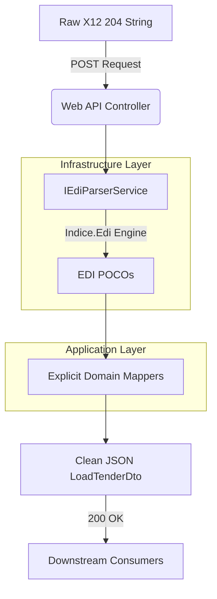

<div align="center">

<h1>🚛 EDI 204 Load Tender Integration Engine</h1>

<p><strong>A high-performance, strictly typed API bridging legacy logistics data with modern REST platforms.</strong></p>

<p align="center">
  
  
  
  
</p>

---
</div>

## 💡 Executive Summary

In high-load logistics environments, the parsing of legacy Electronic Data Interchange (EDI) formats is a major operational bottleneck. This project demonstrates a production-ready approach to processing **ASC X12 204 (Motor Carrier Load Tender)** documents. 

Instead of hiding behind bloated message brokers or black-box mapping libraries, this solution highlights **pure domain logic**. It utilizes strict Domain-Driven Design (DDD), synchronous processing, and explicit manual mapping to ensure that when a trading partner sends malformed data, the system is instantly debuggable and fails gracefully.

---

## 🚀 10-Second Quickstart

Reviewing code shouldn't require fighting with environments. This API is designed for zero-friction onboarding.

```bash
git clone https://github.com/YourUsername/Logistics.EDI.Api.git
cd Logistics.EDI.Api/src/Logistics.EDI.Api
dotnet run
```
*The API is now listening locally on `http://localhost:5000`.*

---

## 🎬 Interactive Demo Scenarios

Logistics data is rarely perfect. To demonstrate the robustness of this architecture, please run the following two scenarios directly from your terminal. 

### Scenario 1: The "Happy Path" (Valid Load Tender)
**What is happening:** We are posting a raw, valid X12 204 payload. The `Indice.Edi` infrastructure layer will deserialize the cryptic segments (`ISA`, `GS`, `ST`), pass the POCOs to the Application layer, where **explicit manual mappers** transform the data into a clean JSON contract.

**Run this command:**
```bash
curl -X POST http://localhost:5000/api/v1/edi/translate-204 \
-H "Content-Type: text/plain" \
-d "ISA*00* *00* *ZZ*SENDERID       *ZZ*RECEIVERID     *250116*1230*U*00401*000000001*0*P*>~
GS*SM*SENDERID*RECEIVERID*20250116*1230*1*X*004010~
ST*204*0001~
B2**XXXX*9999999**PO~
G62*37*20250116~
N1*SH*DIGIS LOGISTICS~
SE*6*0001~
GE*1*1~
IEA*1*000000001~"
```

**Expected Result (200 OK):** You will receive a clean, front-end ready JSON object. Notice how cryptic data like `G62*37` is cleanly mapped to an `EstimatedDeliveryDate`.

```json
{
  "transactionId": "0001",
  "loadNumber": "9999999",
  "carrierAlphaCode": "XXXX",
  "estimatedDeliveryDate": "2025-01-16T00:00:00Z",
  "shipperName": "DIGIS LOGISTICS",
  "status": "Success"
}
```

### Scenario 2: The Reality Check (Malformed Data)
**What is happening:** Trading partners make mistakes. In this payload, we have entirely removed the mandatory `GS` (Functional Group Header) segment. Instead of a catastrophic crash or a vague 500 Internal Server Error, our Global Exception Handling Middleware intercepts the parsing failure.

**Run this command (Notice the missing GS line):**
```bash
curl -X POST http://localhost:5000/api/v1/edi/translate-204 \
-H "Content-Type: text/plain" \
-d "ISA*00* *00* *ZZ*SENDERID       *ZZ*RECEIVERID     *250116*1230*U*00401*000000001*0*P*>~
ST*204*0001~
B2**XXXX*9999999**PO~
SE*4*0001~
IEA*1*000000001~"
```

**Expected Result (400 Bad Request):** The API instantly pinpoints the failure, providing actionable feedback for the integrations team.

```json
{
  "error": "EdiValidationException",
  "message": "Failed to parse EDI document. Mandatory segment 'GS' is missing or malformed.",
  "status": 400
}
```

---

## ⚙️ Core Engineering Decisions

Why was this built this way?

1. **Strictly Manual Mapping (No AutoMapper):** In logistics, a missing `L11` reference number can delay a physical truck. By explicitly writing mappers (`var dto = new LoadTenderDto { LoadNumber = edi.B2.ShipmentId }`), developers can place a breakpoint and instantly trace missing data. AutoMapper obscures this process behind reflection and profiles, making production debugging a nightmare.
2. **Infrastructure Abstraction:** The `Indice.Edi` parser is strictly confined to the `Infrastructure` project. The `Domain` layer only knows about C# interfaces. If the business ever mandates a shift to a commercial EDI parser (like EdiFabric), the API and Business Logic remain 100% untouched.
3. **Synchronous by Design:** While enterprise systems often rely on Azure Service Bus or RabbitMQ, introducing them here obscures the core challenge: memory-efficient string parsing and domain mapping. This API is purposefully synchronous to isolate and prove competency in raw data transformation.

---

## 🏗️ Architecture Flow


