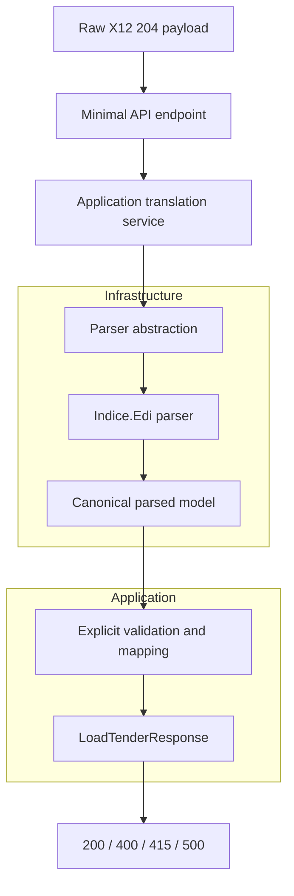

<div align="center">

<h1>EDI 204 Load Tender Integration Engine</h1>

<p><strong>A focused .NET 8 portfolio demo that translates ASC X12 204 load tenders into a stable JSON contract through one clean synchronous API flow.</strong></p>

<p align="center">
  <a href="https://github.com/bonyaroslav/EDI-to-REST-Logistics-Gateway/actions/workflows/ci.yml"></a>
  
  
  
  
</p>

</div>

## Executive Summary

This repository demonstrates a narrow but realistic logistics integration problem: taking a raw `text/plain` ASC X12 `204` load tender and returning a clean JSON payload that a modern downstream REST consumer can use.

The project is intentionally bounded. It is designed to be easy to review in a technical interview or portfolio walkthrough, not to simulate a production integration platform. The value is in the single vertical slice: parser isolation, explicit validation, and manual mapping that is easy to read and explain.

## Reviewer Guide

If you are reviewing this repository quickly, focus on three things:

- Problem solved: translate one raw ASC X12 `204` load tender into a stable JSON contract through a synchronous API.
- Why four projects: Domain keeps the parser boundary clean, Application owns mapping and validation, Infrastructure owns `Indice.Edi`, and API stays thin.
- Intentional non-goals: no partner-specific rules, no `990` or `214` workflows, no persistence, brokers, auth, or broader platform concerns.

## Current Status

The demo is complete for its intended v1 scope.

- One supported transaction set: `ASC X12 204`
- One supported endpoint: `POST /api/v1/edi/translate-204`
- One public success contract: `LoadTenderResponse`
- One public error contract: `error`, `message`, `status`
- One synchronous request/response flow

## What This Demo Covers

- Raw `text/plain` X12 `204` ingestion
- Parsing isolated inside Infrastructure with `Indice.Edi`
- Application-owned validation for predictable `400` responses
- Explicit manual mapping into a stable JSON contract
- Basic logistics context:
  - transaction id
  - load number
  - carrier alpha code
  - set purpose
  - estimated delivery date
  - shipper name
  - pickup and delivery stops

## What It Intentionally Does Not Cover

- Full `204` implementation-guide coverage
- Trading-partner-specific customizations
- `990` tender response processing
- `214` shipment-status processing
- Queues, brokers, worker services, or async ingestion
- Production hardening such as HA, auth, observability, or throughput tuning

## Quickstart

```bash
dotnet run --project src/Logistics.EDI.API
```

The API listens on the configured ASP.NET Core URL. In development, Swagger UI is available at `/swagger` and the generated OpenAPI document is available at `/swagger/v1/swagger.json`.

## Repository Structure

```text
src/
  Logistics.EDI.Domain/
  Logistics.EDI.Application/
  Logistics.EDI.Infrastructure/
  Logistics.EDI.API/
tests/
  Logistics.EDI.Application.Tests/
  Logistics.EDI.Infrastructure.Tests/
  Logistics.EDI.API.IntegrationTests/
samples/
  204/
```

## Sample Payloads

Shared demo payloads live under [`samples/204`](samples/204):

- `valid-original-tender.edi`
- `malformed-payload.edi`
- `missing-gs.edi`
- `unsupported-transaction-990.edi`
- `missing-delivery-stop.edi`

These files are documentation assets first. Tests reuse them so the README examples and automated coverage stay aligned.

## Demo Scenarios

### Valid 204 Translation

```bash
curl -X POST http://localhost:5000/api/v1/edi/translate-204 \
  -H "Content-Type: text/plain" \
  --data-binary @samples/204/valid-original-tender.edi
```

Expected response:

```json
{
  "transactionId": "0001",
  "loadNumber": "9999999",
  "carrierAlphaCode": "XXXX",
  "setPurpose": "Original",
  "estimatedDeliveryDate": "2025-01-16T00:00:00.0000000Z",
  "shipperName": "DIGIS LOGISTICS",
  "stops": [
    {
      "sequence": 1,
      "type": "Pickup",
      "name": "DIGIS LOGISTICS"
    },
    {
      "sequence": 2,
      "type": "Delivery",
      "name": "DESTINATION DC"
    }
  ],
  "status": "Success"
}
```

### Predictable Validation Failure

```bash
curl -X POST http://localhost:5000/api/v1/edi/translate-204 \
  -H "Content-Type: text/plain" \
  --data-binary @samples/204/missing-gs.edi
```

Expected response:

```json
{
  "error": "EdiValidationException",
  "message": "Mandatory segment 'GS' is missing or malformed.",
  "status": 400
}
```

## API Contract

### Success Response

The public success contract is intentionally small and stable:

- `transactionId`
- `loadNumber`
- `carrierAlphaCode`
- `setPurpose`
- `estimatedDeliveryDate`
- `shipperName`
- `stops`
- `status`

### Error Response

All handled API failures use the same shape:

```json
{
  "error": "EdiValidationException",
  "message": "Mandatory segment 'GS' is missing or malformed.",
  "status": 400
}
```

### API Defaults

- Blank or whitespace request bodies return `400`
- Non-`text/plain` content returns `415`
- Unsupported transaction sets such as `990` return `400`
- Known validation failures never leak parser internals
- Unexpected faults return `500` with the same error shape and a generic message
- Business dates are serialized as UTC-midnight ISO-8601 strings
- Blank optional text values normalize to `null`

## Demo Talking Points

- Parser isolation: `Indice.Edi` is used only in Infrastructure, not in Application or API contracts.
- Manual mapping: transformation logic is explicit and reviewable, with no mapping framework hiding business rules.
- Predictable validation: Application and Infrastructure convert malformed or incomplete input into stable client-facing `400` responses.
- Synchronous by design: the project demonstrates the core `204 -> JSON` boundary clearly, without queueing or distributed ingestion noise.

## Architecture Flow



## Verification

```bash
dotnet test Logistics.EDI.Gateway.sln
```

GitHub Actions runs restore, build, and test on every push and pull request via `.github/workflows/ci.yml`.

## Real-World Context

In a production logistics platform, a translated `204` often leads into later workflows such as `990` tender responses and `214` shipment-status events. This repository stops deliberately at the `204 -> JSON` boundary so the demo stays compact, understandable, and interview-friendly.
